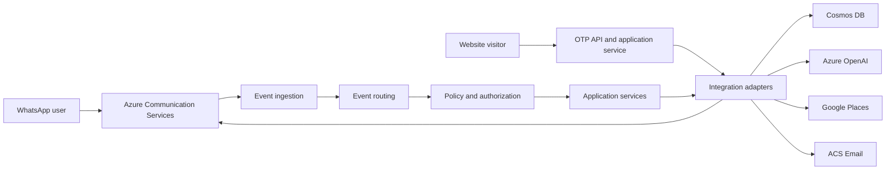

# Asis — secure WhatsApp AI operations assistant

Asis turns WhatsApp into a practical operations interface for Costa Rican
businesses. This public OpenAI Build Week package demonstrates the core
architecture behind its layered webhook, provider adapters, idempotency,
dual-model routing policy, and server-side WhatsApp OTP flow.

The operational repository remains private. This repository intentionally
excludes production infrastructure, credentials, customer data, internal
runbooks, and unsanitized evidence.

- Devpost category: **Work & Productivity**
- Live experience: [CREBS 360](https://costaricaebs.com/)
- WhatsApp: [Message Asis](https://wa.me/50671171975)
- License: [MIT](LICENSE)

## Quick start

Prerequisites: Node.js 20 or later, npm, and Git.

```bash
git clone https://github.com/crebs-cloud/asis-openai-build-week.git
cd asis-openai-build-week
npm ci
npm test
npm run demo
```

No cloud credentials are required for the test suite or demo. Provider clients
are injected as fakes, and all identifiers are documentation values.

## What the demo proves

`npm run demo` processes a sanitized Azure Communication Services Event Grid
message through ingestion, routing, policy, and the application service. It
also creates and verifies a server-generated OTP with an in-memory store and a
fake WhatsApp delivery adapter.

Expected final lines include:

```text
Webhook action: inbound_message
OTP challenge: accepted
OTP verification: verified
Plaintext OTP persisted: no
```

## Architecture



Core boundaries:

1. [`asisWebhookEventIngestion.js`](src/lib/asisWebhookEventIngestion.js)
   validates the request without logging raw private bodies.
2. [`asisWebhookEventRouter.js`](src/lib/asisWebhookEventRouter.js) classifies
   subscription validation, inbound messages, delivery status, and ignored events.
3. [`asisWebhookPolicyService.js`](src/lib/asisWebhookPolicyService.js) applies
   fail-closed administrative policy.
4. [`asisWebhookApplicationService.js`](src/lib/asisWebhookApplicationService.js)
   coordinates the use case and returns explicit actions.
5. [`src/lib/integration`](src/lib/integration) owns provider request shapes and
   returns normalized, sanitized results.

## Server-side WhatsApp OTP

The browser never generates or persists the OTP. The server:

- requires explicit, versioned consent;
- binds each challenge to a random client-session identifier;
- hashes the phone, source IP, OTP, and session token;
- applies resend, per-phone, per-IP, expiry, retention, and attempt limits;
- delivers through a WhatsApp template adapter;
- returns the verified session in a Secure, HttpOnly, SameSite=Strict cookie;
- normalizes failures without leaking raw identifiers or provider responses.

See the versioned contract in
[`contracts/crebs-website-whatsapp-otp.v1.json`](contracts/crebs-website-whatsapp-otp.v1.json)
and the sanitized payloads in [`samples/judge`](samples/judge).

## Tests

The test runner covers:

- webhook ingestion, routing, policy, and action composition;
- Event Grid subscription and delivery-status handling;
- inbound-event idempotency;
- ACS, Cosmos, OpenAI, Google Places, and email adapter normalization;
- OTP hashing, atomic throttling, delivery failure, verification, and session binding;
- HTTP origin checks, cache control, secure cookies, and stable failures;
- general-versus-advanced OpenAI deployment routing.

Focused commands:

```bash
node tests/asisWebhookLayering.test.js
node tests/asisIntegrationAdapters.test.js
node tests/asisOtpApplicationService.test.js
node tests/asisOtpHttpApi.test.js
node tests/openAiModelRoutingRuntime.test.js
```

## Where GPT-5.6 and Codex accelerated the project

GPT-5.6 was used through Codex as the engineering and operations collaborator.
That build-time use is separate from the models configured behind the
application's Azure OpenAI adapter.

Codex accelerated the work by:

- reconciling the Website, Asis, and Control Tower boundaries into a versioned contract;
- decomposing a large webhook into independently testable layers;
- replacing browser-generated OTP with a hashed, expiring, rate-limited server challenge;
- building provider adapters and sanitized contract tests;
- running repository checks, inspecting CI, and preserving exact release evidence;
- coordinating protected GitHub and Azure OIDC workflows without committing secrets.

GPT-5.6 was most valuable when decisions crossed application behavior, cloud
identity, security policy, deployment constraints, and rollback safety. Codex
then grounded those decisions in code, tests, documentation, and CI.

## Key decisions

| Decision | Rationale | Code |
| --- | --- | --- |
| Server-generated OTP | Removes client control of the secret | [`asisOtpApplicationService.js`](src/lib/asisOtpApplicationService.js) |
| Layered webhook | Makes security and routing independently testable | [`asisWebhookApplicationService.js`](src/lib/asisWebhookApplicationService.js) |
| Adapter-owned provider mechanics | Keeps credentials and raw responses out of business logic | [`src/lib/integration`](src/lib/integration) |
| Idempotent event claims | Prevents duplicate provider deliveries from duplicating side effects | [`asisInboundEventIdempotencyService.js`](src/lib/asisInboundEventIdempotencyService.js) |
| Explicit model-routing policy | Uses the advanced deployment only for technical intent and fails closed | [`openAiModelRoutingPolicy.js`](src/lib/openAiModelRoutingPolicy.js) |

## Build provenance

- Codex `/feedback` Session ID: `019f59af-15d0-78e1-860d-caa2883f2bad`
- Model used for the core Codex task: **GPT-5.6**
- Core work: contract design, OTP security, webhook layering, adapters, provider
  gates, CI, and production validation.

## Optional provider configuration

Copy [`.env.example`](.env.example) as a variable inventory only. The public
tests do not load `.env` and do not make live calls. If adapting this package,
store credentials in your runtime secret store and use non-production resources.

## Public-package boundary

This package is suitable for judging, local testing, and architectural review.
It is not a deployment bundle and contains no production authorization values.
See [SECURITY.md](SECURITY.md) before reporting a vulnerability.
